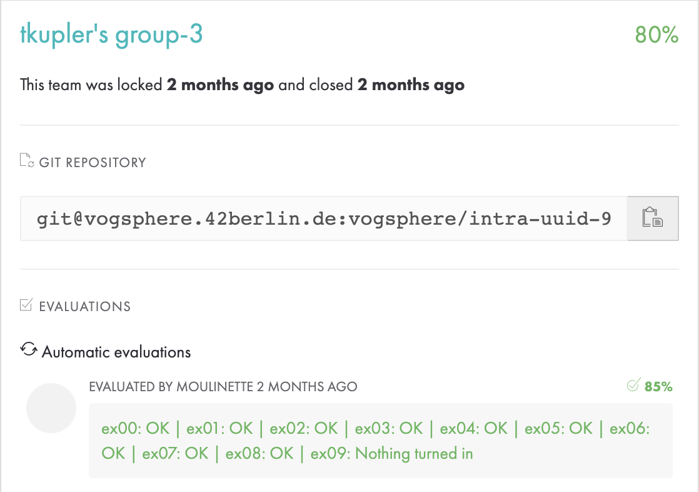
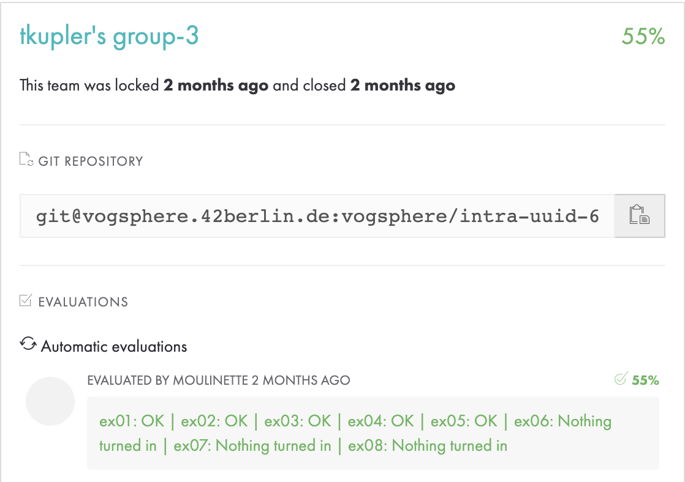
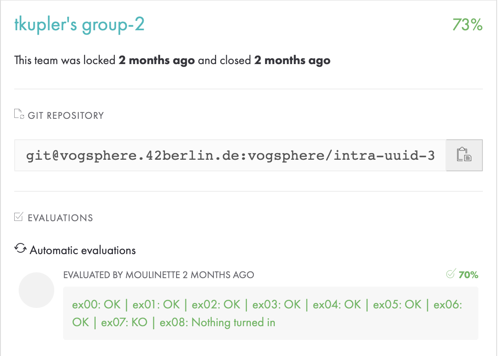
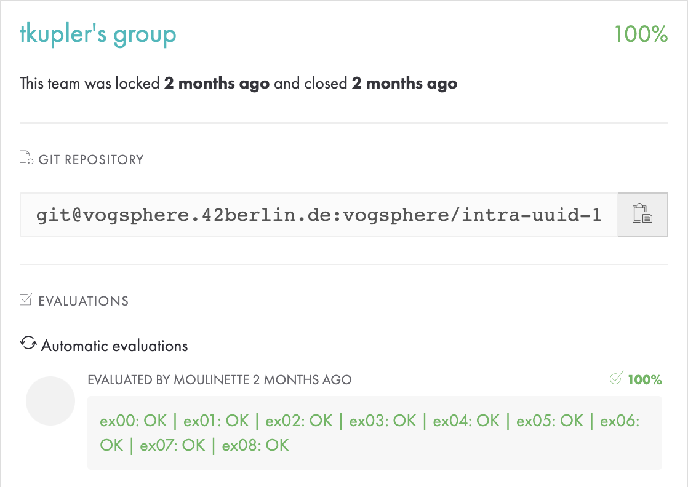
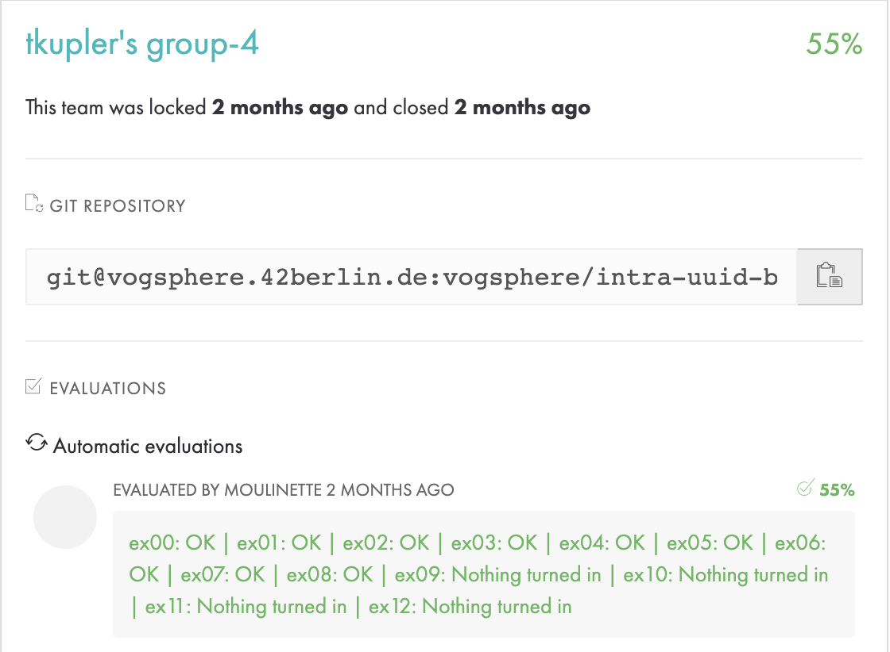
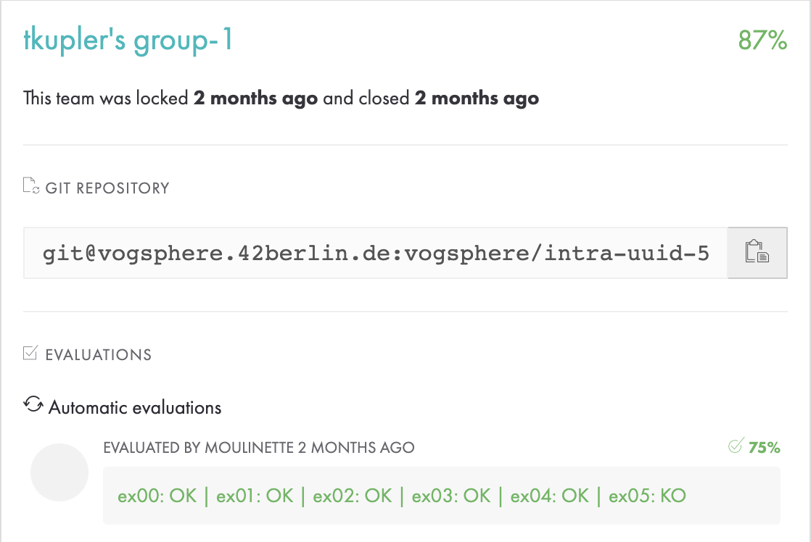
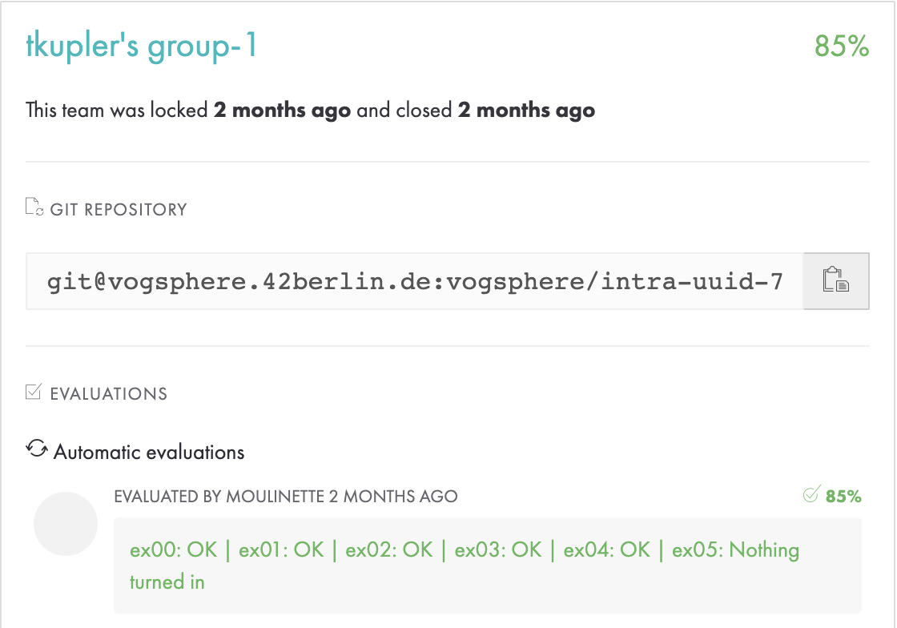

# 42-Piscine

I have completed the [Coding Bootcamp Piscine](https://42berlin.de/the-piscine/) in Berlin at the 42 Coding School and these are my solutions to the different exercies.

## [Shell 00](https://github.com/froilainhaeckse/42-Piscine/tree/main/1_Shell00)

## [Shell 01](https://github.com/froilainhaeckse/42-Piscine/tree/main/1_Shell01)

## [C00](https://github.com/froilainhaeckse/42-Piscine/tree/main/2_C00)

## [C01](https://github.com/froilainhaeckse/42-Piscine/tree/main/2_C01)

## [C02](https://github.com/froilainhaeckse/42-Piscine/tree/main/2_C02)

## [C03](https://github.com/froilainhaeckse/42-Piscine/tree/main/2_C03)

## [C04](https://github.com/froilainhaeckse/42-Piscine/tree/main/2_C04)

